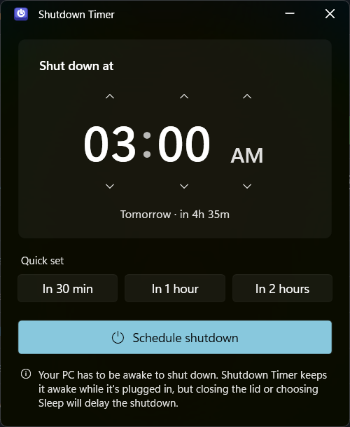
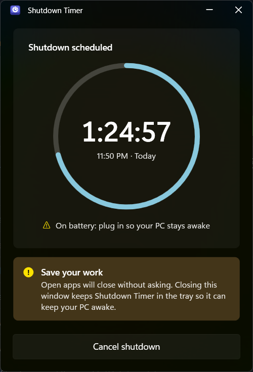

<p align="center">
  <picture>
    <source media="(prefers-color-scheme: dark)" srcset="brand/shutdown-timer-horizontal-dark.svg">
    
  </picture>
</p>

<p align="center">
  <strong>Turn off your PC at the time you choose.</strong><br>
  A small, native-feeling Windows 11 utility, and the first tool in <em>Keycaps</em>.
</p>

<p align="center">
  
  
  
</p>

<p align="center">
  
  &nbsp;
  
</p>

## Contents

- [Features](#features)
- [Install](#install)
- [Usage](#usage)
- [How it works](#how-it-works)
- [Known limitations](#known-limitations)
- [Build from source](#build-from-source)
- [Releasing](#releasing)
- [Project structure](#project-structure)
- [Roadmap](#roadmap)
- [License](#license)

## Features

- **Pick a clock time, not a duration.** Set 3:00 AM and it shuts down at 3:00 AM. If that time has already passed today, it's set for tomorrow.
- **Quick set:** in 30 minutes, 1 hour or 2 hours.
- **Live countdown** with a progress ring once a shutdown is scheduled, and one click to cancel.
- **Survives closing the app.** Windows holds the shutdown, not the app.
- **Keeps the PC awake until then.** While a shutdown is pending, the app holds a power request so Windows doesn't idle into sleep, and closing the window keeps it in the system tray.
- **Handles sleep.** After the PC wakes, it checks the clock and corrects Windows' countdown. If the shutdown time passed while the PC was asleep, it either shuts down after a 60-second warning (if it's within 10 minutes) or tells you it was skipped. It never powers off hours later when you open the lid.
- **Native Windows 11 look:** Fluent controls, a Mica Alt backdrop and a custom title bar. Follows your light or dark theme.

## Install

1. Download `ShutdownTimer-vX.Y.Z-win-x64.exe` from the latest [release](../../releases/latest).
2. Install the [.NET 9 Desktop Runtime (x64)](https://dotnet.microsoft.com/download/dotnet/9.0) if you don't already have it.
3. Run the exe. It's a single file and needs no installer.

The exe isn't code-signed, so Windows SmartScreen may warn the first time you run it.

## Usage

| To | Do |
|---|---|
| Set the time | Use the chevrons above and below the hour, minute and AM/PM, or scroll over them |
| Set it relative to now | Pick **In 30 min**, **In 1 hour** or **In 2 hours** |
| Schedule | **Schedule shutdown**, or press Enter |
| Cancel | **Cancel shutdown** |

You can close the window after scheduling: the app moves to the system tray and keeps the PC awake. Click the tray icon to reopen it, or right-click for **Cancel shutdown** and **Exit**.

> [!WARNING]
> At the scheduled time, Windows closes open apps **without asking you to save**. Save your work first.

## How it works

- Scheduling runs Windows' own `shutdown /s /t <seconds> /d p:0:0`, with the seconds counted to the chosen time. Cancelling runs `shutdown /a`.
- **Staying awake:** while a shutdown is pending, the app holds a `PowerRequestSystemRequired` power request (`PowerSetRequest`). It shows up in `powercfg /requests`, run from an administrator terminal.
- **Sleep:** `shutdown /t` counts seconds, and the count pauses while the PC sleeps. So after every resume, the app compares the clock with the target, which is the source of truth. It detects a resume from Windows' resume event or a gap between its 1-second ticks, since apps don't always get the event on Modern Standby. It then re-arms the countdown, shuts down late with a warning, or reports a skipped shutdown. The rules live in [`ShutdownPlanner.cs`](ShutdownPlanner.cs).
- The chosen time is saved to `%LOCALAPPDATA%\ShutdownTimer\scheduled.txt`, so the app can pick the schedule up again after a restart or sleep. If Windows restarted after the target, the shutdown already happened and the saved time is simply dropped.
- The window applies the Mica Alt backdrop through `DwmSetWindowAttribute` and draws its own title bar.

## Known limitations

- **The PC has to be awake to shut down.** No app can stop you from sleeping the PC: Windows ends power requests when you close the lid, press the power button or choose **Sleep**. In that case the shutdown is skipped, or runs late (within 10 minutes) after the PC wakes.
- **On battery, keeping the PC awake only goes so far.** On Modern Standby laptops running on battery, Windows ends the power request 5 minutes after the sleep timeout. Plug in for a shutdown that's hours away.
- **Waking the PC to shut it down isn't supported.** That would need wake timers, which can be turned off in power settings (they are on the development laptop) and aren't a dependable wake source on Modern Standby PCs.
- **Apps aren't asked to save.** See the warning above.
- **Tested on Windows 11 only.** On older builds without the Mica API, the window falls back to a solid background (untested).

## Build from source

**Prerequisites:** Windows 10 or 11 and the [.NET 9 SDK](https://dotnet.microsoft.com/download/dotnet/9.0).

```powershell
git clone https://github.com/RohanGupta15/keycaps.git
cd keycaps
dotnet run -c Release
```

To build the same single-file exe as the releases:

```powershell
dotnet publish -c Release -r win-x64 --self-contained false -p:PublishSingleFile=true -o publish
```

### Testing

```powershell
dotnet test tests/ShutdownTimer.Tests/ShutdownTimer.Tests.csproj
```

Run the app with `--dry-run` to try scheduling, sleep handling and the tray without shutting anything down. In that mode it logs the `shutdown` commands it would run to `%LOCALAPPDATA%\ShutdownTimer-dryrun\dry-run.log`, and keeps its own schedule there:

```powershell
dotnet run -c Release -- --dry-run
```

## Releasing

The version lives in `<Version>` in [`ShutdownTimer.csproj`](ShutdownTimer.csproj). When a change merged to `main` raises the **major** version above the highest released `vN.x.x` tag (for example `1.4.2` → `2.0.0`), the [Release workflow](.github/workflows/release.yml) builds the exe and publishes a GitHub Release with it. Minor and patch bumps don't release.

If the `RELEASE_TOKEN` secret (a fine-grained PAT with **Contents: Read and write** on this repo) is set, releases are created under its owner's name. Otherwise they're created by `github-actions[bot]`.

## Project structure

```
keycaps/
├─ App.xaml(.cs)            app entry: single instance, --dry-run, Fluent theme
├─ MainWindow.xaml(.cs)     UI, Mica Alt window chrome, scheduling, sleep handling
├─ ShutdownPlanner.cs       what to do after sleep or restart (unit-tested)
├─ KeepAwake.cs             power request that keeps the PC awake
├─ ShutdownCommand.cs       runs shutdown.exe (or logs it in --dry-run)
├─ TrayIcon.cs              system tray icon and menu
├─ ShutdownTimer.csproj     version, icon, build settings
├─ tests/                   xUnit tests for ShutdownPlanner
├─ brand/                   logo kit: SVG masters, .ico, PNGs, guidelines
│  └─ build/                scripts that regenerate the kit
├─ docs/screenshots/        images used in this README
└─ .github/workflows/       release automation
```

## Roadmap

Keycaps is meant to grow into a set of small, single-purpose Windows utilities, in the spirit of PowerToys. Each tool gets its own key icon in a shared style; see the [brand guidelines](brand/GUIDELINES.md#suite-system-for-future-tools).

## License

No license has been chosen yet. Until one is added, all rights are reserved by the author.
